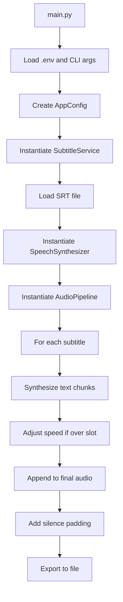

# Technical README

This document provides an in-depth technical overview of the SRT to Audio application, including architecture, class responsibilities, data flow, and implementation details.

## Architecture Overview

The application is structured as an object-oriented Python project designed for converting SRT subtitle files into timed speech audio using OpenAI's TTS API. It emphasizes modularity, caching for resilience, and environment-driven configuration.

### Project Structure

```
srt-to-audio/
├── main.py                 # CLI entry point; orchestrates services
├── classes/
│   ├── __init__.py         # Package marker
│   ├── audio_pipeline.py   # Audio assembly and timing logic
│   ├── config.py           # Configuration management from env/CLI
│   ├── speech_synthesizer.py # TTS wrapper with caching
│   ├── subtitle_service.py # SRT file loading
│   └── utils.py            # Shared utilities (audio, text, time)
├── .env                    # User-specific configuration (API keys, defaults)
├── .env.example            # Template for .env
├── input.srt               # Default input subtitle file
├── voiceover.mp3           # Default output audio file
├── requirements.txt        # Python dependencies
├── README.md               # User-facing documentation
└── Technical_README.md     # This file
```

- **main.py**: The command-line interface that loads environment variables, parses arguments, instantiates classes, and runs the pipeline.
- **classes/**: Modular components for separation of concerns.
- **.env**: Environment file for secrets and defaults; loaded via `python-dotenv`.
- **input.srt**: Assumed input file; configurable via `TTS_SRT_PATH`.
- **voiceover.mp3**: Default output; configurable via `TTS_OUTPUT_PATH`.

## Data Flow

The application follows a linear pipeline:

1. **Configuration Loading**: `main.py` loads `.env` and CLI args into `AppConfig`.
2. **Subtitle Loading**: `SubtitleService` parses the SRT file into subtitle objects.
3. **Audio Synthesis**: `AudioPipeline` iterates subtitles, synthesizing text via `SpeechSynthesizer`, adjusting speed if needed, and assembling into a final track.
4. **Output**: Final audio is exported to the specified file.

### Mermaid Diagram



## Class Explanations

### SubtitleService

**Location**: `classes/subtitle_service.py`

**Purpose**: Handles loading and optional transliteration of SRT files to Cyrillic Serbian for better OpenAI TTS recognition.

**Key Methods**:
- `__init__(transliterate: bool)`: Sets whether to enable transliteration.
- `load(source: Path) -> List[srt.Subtitle]`: Loads subtitles, checking for Cyrillic and transliterating if needed.
- `_prepare_file(source: Path) -> Path`: Determines the file to use, creating a transliterated copy if necessary.
- `_is_cyrillic(file_path: Path) -> bool`: Detects if the file contains Cyrillic characters.
- `_transliterate_file(source: Path, target: Path)`: Converts Latin Serbian to Cyrillic using cyrtranslit.

**How it works**: If transliteration is enabled and the file isn't already Cyrillic, it parses the SRT, transliterates each subtitle's content to Cyrillic, and saves to "input-transliterated.srt". Uses the transliterated file for processing.

### SpeechSynthesizer

**Location**: `classes/speech_synthesizer.py`

**Purpose**: Wraps OpenAI's TTS API with caching to avoid redundant requests and handle retries.

**Key Methods**:
- `__init__(client, model, voice, output_format, cache_dir)`: Initializes with OpenAI client, synthesis parameters, and cache directory.
- `synthesize(text: str, speed: float = 1.0) -> AudioSegment`: Generates audio for text, applies speed adjustment, and returns a `pydub.AudioSegment`.
- `_load_or_generate_bytes(text: str) -> bytes`: Checks cache for existing audio; if not, calls `_request_speech()`.
- `_request_speech(text: str) -> bytes`: Makes the API call with retry logic, extracts bytes from response.

**How it works**: Caches synthesized chunks on disk using SHA1 hashes of input parameters. Retries on failure (up to 4 attempts). Applies speed changes post-synthesis using `change_playback_speed` from `utils.py`. Handles different response formats from the OpenAI SDK.

### AudioPipeline

**Location**: `classes/audio_pipeline.py`

**Purpose**: Assembles synthesized speech into a single timed audio track, respecting subtitle timings.

**Key Methods**:
- `__init__(synthesizer, fill_to_end, hard_cut, pad_leading_ms, pad_trailing_ms, max_chars_per_call, max_speedup)`: Configures pipeline behavior.
- `build(subtitles: Sequence[srt.Subtitle]) -> AudioSegment`: Main method that processes subtitles into final audio.

**How it works**:
- Iterates through subtitles, synthesizing text in chunks.
- If synthesized speech exceeds the subtitle slot length, speeds it up (capped by `max_speedup`) to fit.
- If shorter, pads with silence (if `fill_to_end` is enabled).
- Handles gaps between subtitles by adding silence.
- Applies leading/trailing padding.
- Uses `chunk_text` for large texts and `change_playback_speed` for adjustments.

### Config

**Location**: `classes/config.py`

**Purpose**: Centralizes configuration from environment variables and CLI arguments.

**Key Methods**:
- `from_args(args) -> AppConfig`: Static method that merges CLI args with env defaults.

**How it works**: Defines defaults (e.g., `DEFAULT_MODEL = "gpt-4o-mini-tts"`), provides helper functions for env parsing (e.g., `_env_bool`, `_env_float`), and prioritizes CLI args over env vars.

### Utils

**Location**: `classes/utils.py`

**Purpose**: Shared utility functions for audio manipulation, text processing, and time conversion.

**Key Functions**:
- `timedelta_to_ms(td) -> int`: Converts `datetime.timedelta` to milliseconds.
- `chunk_text(text: str, max_chars: int) -> List[str]`: Splits text into chunks under the API limit.
- `clamp(value: float, min_value: float, max_value: float) -> float`: Constrains a value to a range.
- `change_playback_speed(segment: AudioSegment, speed: float) -> AudioSegment`: Adjusts audio speed using `pydub`.
- `ensure_directory(path: Path)`: Creates directories if needed.

**How it works**: Pure functions for reusability. Audio speed changes use frame rate manipulation for pitch-preserving adjustments.

## Implementation Details

- **Caching**: TTS chunks are cached in `.cache/` with hashed filenames to survive interruptions and avoid re-synthesis.
- **Timing Logic**: Normal speed is preserved; only accelerates when necessary to fit slots, up to `max_speedup` (default 1.15x). Shorter segments are padded with silence.
- **Error Handling**: Retries in `SpeechSynthesizer` for API failures; configuration validation in `Config`.
- **Dependencies**: `openai` for TTS, `pydub` for audio, `srt` for parsing, `tenacity` for retries, `python-dotenv` for env loading.
- **Environment Variables**: All defaults are in `.env` to avoid hard-coding and CLI exposure of secrets.

## Testing and Validation

- Compile with `python3 -m compileall` to check syntax.
- Run `python3 main.py` to test end-to-end.
- Adjust `.env` values for customization (e.g., `TTS_MAX_SPEEDUP=1.1` for less acceleration).

This setup ensures maintainable, efficient SRT-to-audio conversion with minimal user friction.