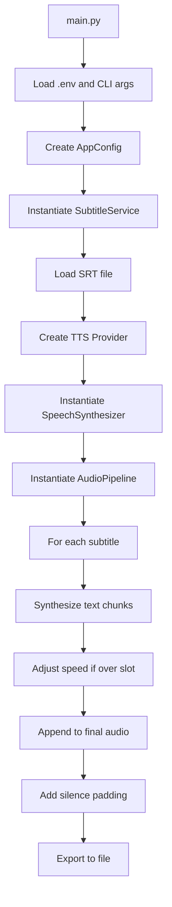

# Technical README

This document provides an in-depth technical overview of the SRT to Audio application, including architecture, class responsibilities, data flow, and implementation details.

## Architecture Overview

The application is structured as an object-oriented Python project designed for converting SRT subtitle files into timed speech audio using pluggable TTS providers (OpenAI, ElevenLabs, Google Cloud). It emphasizes modularity, caching for resilience, and environment-driven configuration.

### Project Structure

```
srt-to-audio/
├── main.py                 # CLI entry point; orchestrates services
├── classes/
│   ├── __init__.py         # Package marker
│   ├── audio_pipeline.py   # Audio assembly and timing logic
│   ├── config.py           # Configuration management from env/CLI
│   ├── speech_synthesizer.py # Provider-agnostic TTS wrapper with caching
│   ├── tts_factory.py      # Factory that selects a provider implementation
│   ├── tts_providers/      # Strategy implementations per provider
│   ├── subtitle_service.py # SRT file loading and transliteration
│   └── utils.py            # Shared utilities (audio, text, time)
├── .env                    # User-specific configuration (API keys, defaults)
├── .env.example            # Template for .env with comprehensive documentation
├── .cache/                 # Organized cache: {provider}/{job_name}/
├── output/                 # Generated audio files: {job_name}-{provider}-{output_name}
├── example/                # Example SRT files for reference
│   └── input.srt           # Sample input file
├── input.srt               # Default input subtitle file (user provides)
├── requirements.txt        # Python dependencies
├── README.md               # User-facing documentation
└── Technical_README.md     # This file
```

- **main.py**: The command-line interface that loads environment variables, parses arguments, instantiates classes, and runs the pipeline.
- **classes/**: Modular components for separation of concerns.
- **.env**: Environment file for secrets and defaults; loaded via `python-dotenv`.
- **.env.example**: Comprehensive template with all configuration options documented.
- **.cache/**: Hierarchically organized cache: `.cache/{provider}/{job_name}/` for TTS responses and transliterated files.
- **output/**: Directory for final audio files with structured naming: `{job_name}-{provider}-{output_name}.mp3`.
- **example/**: Reference directory containing sample SRT files.
- **input.srt**: Default input file (user must provide); location configurable via `TTS_SRT_PATH`.

## Data Flow

The application follows a linear pipeline:

1. **Configuration Loading**: `main.py` loads `.env` and CLI args into `AppConfig`.
2. **Subtitle Loading**: `SubtitleService` parses the SRT file into subtitle objects.
3. **Provider Selection**: `create_tts_provider` builds a concrete provider strategy based on configuration.
4. **Audio Synthesis**: `AudioPipeline` iterates subtitles, synthesizing text via `SpeechSynthesizer`, adjusting speed if needed, and assembling into a final track.
5. **Output**: Final audio is exported to the specified file.

### Mermaid Diagram



## Class Explanations

### SubtitleService

**Location**: `classes/subtitle_service.py`

**Purpose**: Handles loading and optional transliteration of SRT files to Cyrillic Serbian for better OpenAI TTS recognition.

**Key Methods**:
- `__init__(transliterate: bool)`: Sets whether to enable transliteration.
- `load(source: Path) -> List[srt.Subtitle]`: Loads subtitles, checking for Cyrillic and transliterating if needed.
- `_prepare_file(source: Path) -> Path`: Determines the file to use, creating a transliterated copy if necessary.
- `_is_cyrillic(file_path: Path) -> bool`: Detects if the file contains Cyrillic characters.
- `_transliterate_file(source: Path, target: Path)`: Converts Latin Serbian to Cyrillic using cyrtranslit.

**How it works**: If transliteration is enabled and the file isn't already Cyrillic, it parses the SRT, transliterates each subtitle's content to Cyrillic, and saves to `.cache/{provider}/{job_name}/input-transliterated.srt`. Uses the transliterated file for processing. This organization keeps transliterated files separate for different providers and jobs.

### SpeechSynthesizer

**Location**: `classes/speech_synthesizer.py`

**Purpose**: Wraps the provider strategy with caching to avoid redundant requests and handle retries.

**Key Methods**:
- `__init__(provider, cache_dir)`: Injects a `TTSProvider` strategy and cache directory.
- `synthesize(text: str, speed: float = 1.0) -> AudioSegment`: Generates audio for text, applies speed adjustment, and returns a `pydub.AudioSegment`.
- `_load_or_generate_bytes(text: str) -> bytes`: Checks cache for existing audio; if not, calls `_request_speech()`.
- `_request_speech(text: str) -> bytes`: Delegates to the injected provider strategy with retry logic.

**How it works**: Caches synthesized chunks on disk in `.cache/{provider}/{job_name}/` using SHA1 hashes of provider fingerprints and input parameters. This hierarchical organization allows multiple projects (jobs) to maintain separate caches per provider. Retries on failure (up to 4 attempts). Applies speed changes post-synthesis using `change_playback_speed` from `utils.py`. Normalizes response bytes from each provider implementation.

### AudioPipeline

**Location**: `classes/audio_pipeline.py`

**Purpose**: Assembles synthesized speech into a single timed audio track, respecting subtitle timings.

**Key Methods**:
- `__init__(synthesizer, fill_to_end, hard_cut, pad_leading_ms, pad_trailing_ms, max_chars_per_call, max_speedup)`: Configures pipeline behavior.
- `build(subtitles: Sequence[srt.Subtitle]) -> AudioSegment`: Main method that processes subtitles into final audio.

**How it works**:
- Iterates through subtitles, synthesizing text in chunks.
- If synthesized speech exceeds the subtitle slot length, speeds it up (capped by `max_speedup`) to fit.
- If shorter, pads with silence (if `fill_to_end` is enabled).
- Handles gaps between subtitles by adding silence.
- Applies leading/trailing padding.
- Uses `chunk_text` for large texts and `change_playback_speed` for adjustments.

### Config & Provider Factory

**Location**: `classes/config.py`

**Purpose**: Centralizes configuration from environment variables and CLI arguments and produces provider-specific configuration dataclasses.

**Key Methods**:
- `from_args(args) -> AppConfig`: Static method that merges CLI args with env defaults.

**How it works**: Defines cross-provider defaults, parses provider-specific environment variables, canonicalizes provider names, and emits typed configuration objects consumed by the provider factory.

### Utils

**Location**: `classes/utils.py`

**Purpose**: Shared utility functions for audio manipulation, text processing, and time conversion.

**Key Functions**:
- `timedelta_to_ms(td) -> int`: Converts `datetime.timedelta` to milliseconds.
- `chunk_text(text: str, max_chars: int) -> List[str]`: Splits text into chunks under the API limit.
- `clamp(value: float, min_value: float, max_value: float) -> float`: Constrains a value to a range.
- `change_playback_speed(segment: AudioSegment, speed: float) -> AudioSegment`: Adjusts audio speed using `pydub`.
- `ensure_directory(path: Path)`: Creates directories if needed.

**How it works**: Pure functions for reusability. Audio speed changes use frame rate manipulation for pitch-preserving adjustments.

## Multi-Provider Architecture

The application supports three TTS providers through a pluggable strategy pattern:

### Provider Strategy Pattern

Each provider implements the `TTSProvider` interface defined in `classes/tts_providers/base.py`:
- **name**: Unique identifier (`openai`, `elevenlabs`, `google`)
- **output_format**: Audio file extension (e.g., `mp3`)
- **cache_fingerprint**: Tuple of configuration parameters for cache key generation
- **synthesize(text)**: Generates audio bytes for the given text

### Provider Selection

The provider is selected via:
1. `--provider` CLI argument
2. `TTS_PROVIDER` environment variable
3. Default: `openai`

The `create_tts_provider` factory in `tts_factory.py` instantiates the appropriate provider with its specific configuration.

### Cache Organization by Provider and Job

Caches are organized hierarchically: `.cache/{provider}/{job_name}/`

- **Provider isolation**: Different providers cache separately, avoiding conflicts from different audio formats or synthesis characteristics.
- **Job organization**: Multiple projects or versions can run concurrently without cache collisions.
- **Job name**: Specified via `--job-name` CLI argument, `TTS_JOB_NAME` environment variable, or defaults to `"default"`.

Example cache structure:
```
.cache/
├── openai/
│   ├── default/
│   │   ├── abc123...def.mp3
│   │   └── input-transliterated.srt
│   └── contest-training/
│       ├── xyz789...uvw.mp3
│       └── input-transliterated.srt
├── elevenlabs/
│   └── default/
│       └── fed456...cba.mp3
└── google/
    └── production/
        └── 987fed...321.mp3
```

### Output File Naming

Generated audio files follow the pattern: `output/{job_name}-{provider}-{base_output_name}`

Examples:
- Default: `output/default-openai-voiceover.mp3`
- Custom job: `output/contest-training-elevenlabs-voiceover.mp3`
- With env override: `output/production-google-narration.mp3`

This naming convention makes it easy to identify which provider and job produced each output file.

## Environment Variables Reference

All configuration is managed through environment variables, typically in a `.env` file. A comprehensive `.env.example` template is provided with detailed documentation for each variable.

### Core Settings

- **TTS_PROVIDER**: Provider selection (`openai`, `elevenlabs`, `google`)
- **TTS_JOB_NAME**: Job name for cache and output organization (default: `default`)
- **TTS_SRT_PATH**: Input SRT file path (default: `input.srt`)
- **TTS_OUTPUT_PATH**: Base output filename (default: `voiceover.mp3`)
- **TTS_CACHE_DIR**: Base cache directory (default: `.cache`)
- **TTS_TRANSLITERATE**: Enable Latin-to-Cyrillic transliteration for Serbian (default: `1`)

### Audio Processing

- **TTS_FILL_TO_END**: Pad audio to subtitle end time (default: `1`)
- **TTS_HARD_CUT**: Trim instead of speeding up overlong segments (default: `0`)
- **TTS_MAX_SPEEDUP**: Maximum speed multiplier (default: `1.15`)
- **TTS_PAD_START_MS**: Leading silence in milliseconds (default: `0`)
- **TTS_PAD_END_MS**: Trailing silence in milliseconds (default: `0`)
- **TTS_MAX_CHARS**: Maximum characters per TTS request (default: `4000`)

### OpenAI Provider

- **OPENAI_API_KEY**: API key (required)
- **OPENAI_TTS_MODEL**: Model identifier (default: `gpt-4o-mini-tts`)
- **OPENAI_TTS_VOICE**: Voice preset (default: `alloy`)
- **OPENAI_TTS_FORMAT**: Output format (default: `mp3`)
- **OPENAI_TTS_INSTRUCTIONS**: System prompt for the model
- **OPENAI_TTS_FORCE_LANGUAGE**: Force language prefix (optional)

### ElevenLabs Provider

- **ELEVENLABS_API_KEY**: API key (required)
- **ELEVENLABS_VOICE_ID**: Voice identifier (default: `JBFqnCBsd6RMkjVDRZzb`)
- **ELEVENLABS_MODEL_ID**: Model identifier (default: `eleven_multilingual_v2`)
- **ELEVENLABS_OUTPUT_FORMAT**: Output format (default: `mp3_44100_128`)
- **ELEVENLABS_STABILITY**: Voice stability 0.0-1.0 (optional)
- **ELEVENLABS_SIMILARITY_BOOST**: Similarity boost 0.0-1.0 (optional)
- **ELEVENLABS_STYLE**: Style exaggeration 0.0-1.0 (optional)
- **ELEVENLABS_USE_SPEAKER_BOOST**: Enable speaker boost (optional)

### Google Cloud Provider

- **GOOGLE_APPLICATION_CREDENTIALS**: Path to service account JSON (required)
- **GOOGLE_TTS_VOICE_NAME**: Voice identifier (default: `en-US-Neural2-A`)
- **GOOGLE_TTS_AUDIO_ENCODING**: Audio encoding (default: `MP3`)
- **GOOGLE_TTS_SPEAKING_RATE**: Speaking rate 0.25-4.0 (optional)
- **GOOGLE_TTS_PITCH**: Pitch adjustment -20.0 to 20.0 (optional)
- **GOOGLE_TTS_SAMPLE_RATE_HZ**: Sample rate in Hz (optional)
- **GOOGLE_TTS_VOLUME_GAIN_DB**: Volume adjustment in dB (optional)
- **GOOGLE_TTS_LANGUAGE_CODE**: Language override (optional)
- **GOOGLE_TTS_EFFECTS_PROFILE_IDS**: Comma-separated effects profiles (optional)

See `.env.example` for comprehensive documentation with examples and valid value ranges for each variable.

## Implementation Details

- **Caching**: TTS chunks are cached in `.cache/{provider}/{job_name}/` with hashed filenames to survive interruptions and avoid re-synthesis.
- **Timing Logic**: Normal speed is preserved; only accelerates when necessary to fit slots, up to `max_speedup` (default 1.15x). Shorter segments are padded with silence.
- **Error Handling**: Retries in `SpeechSynthesizer` for API failures; configuration validation in `Config`.
- **Dependencies**: `openai`, `elevenlabs`, `google-cloud-texttospeech` for provider SDKs; `pydub` for audio; `srt` for parsing; `tenacity` for retries; `python-dotenv` for env loading.
- **Environment Variables**: All defaults are in `.env` to avoid hard-coding and CLI exposure of secrets.

## Testing and Validation

- Compile with `python3 -m compileall` to check syntax.
- Run `python3 main.py` to test end-to-end.
- Adjust `.env` values for customization (e.g., `TTS_MAX_SPEEDUP=1.1` for less acceleration).

This setup ensures maintainable, efficient SRT-to-audio conversion with minimal user friction.